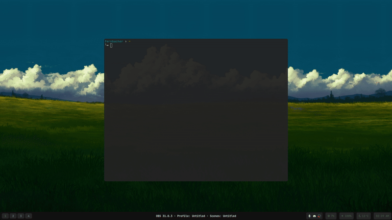

# UMU-Launch-Gum: TUI Launcher for Windows Games on Linux

A script providing a Terminal User Interface (TUI) using `gum` to launch Windows games on Linux via `umu-launcher` and Proton/Wine-GE.



## Features

* Select game `.exe` files using a file browser.
* Detects and allows selection of Proton/Wine-GE versions (Steam official & custom).
* Set environment variables (e.g., `DXVK_HUD=1`) or command-line arguments per launch.
* Integrates with `Gamescope`, `Gamemode`, and `MangoHud` if installed (optional).
* Uses a configurable shared Wine prefix (default: `umu-default`).
* Logs launch commands and game output to `~/.local/share/umu-launch-gum/logs/`.
* Quick launch mode `--quick` or `-q` which simply loads your last game played.

## Requirements

**Required:**

* `bash`
* `gum`
* `umu-launcher`
* `coreutils` (provides `realpath`, `date`, `tee`, `mkdir`, `sort`)
* Installed Proton or Wine-GE version(s).

**Optional:**

* `gamemode`
* `gamescope`
* `mangohud`

## Usage

1.  Make the script executable:
    ```bash
    chmod +x umu-launch-gum.sh
    ```
2.  Run the script:
    ```bash
    ./umu-launch-gum.sh
    ```
3.  Follow the TUI prompts to select the game, Proton version, and options.

## Configuration (Optional)

Customize default behavior by creating a configuration file.

### Config File Location

The script checks for a configuration file at: `~/.config/umu-launch-gum/config.conf`

If this file doesn't exist, the script uses built-in defaults.

### Config File Format

* Use `VARIABLE_NAME="value"` format, one per line.
* Lines starting with `#` are comments and are ignored.
* Blank lines are ignored.
* For multiple paths (e.g., `CUSTOM_PROTON_DIRS`), separate them with a space within the double quotes (`" "`).

### Configurable Variables

#### `CUSTOM_PROTON_DIRS`

* **Purpose:** Specify directories containing custom Proton/Wine-GE builds (e.g., `compatibilitytools.d` folders).
* **Format:** Full paths separated by spaces, within double quotes.
* **Example:**
    ```conf
    CUSTOM_PROTON_DIRS="$HOME/.steam/root/compatibilitytools.d /mnt/data/proton-builds"
    ```

#### `STEAM_LIB_DIRS`

* **Purpose:** Specify Steam library root directories to find official Proton versions (looks in `steamapps/common`).
* **Format:** Full paths separated by spaces, within double quotes.
* **Example:**
    ```conf
    STEAM_LIB_DIRS="$HOME/.local/share/Steam /mnt/ssd/SteamLibrary"
    ```

#### `STEAM_PROTON_SUBDIR`

* **Purpose:** The sub-directory within Steam libraries where official Proton versions are located. Changing this is rarely needed.
* **Format:** Folder name (quotes usually not needed).
* **Default:** `steamapps/common`
* **Example:**
    ```conf
    STEAM_PROTON_SUBDIR="steamapps/common"
    ```

#### `DEFAULT_GAMESCOPE_PARAMS`

* **Purpose:** Set default flags for Gamescope when enabled. You can override these defaults at launch time.
* **Format:** Flags within double quotes.
* **Example:**
    ```conf
    DEFAULT_GAMESCOPE_PARAMS="-f -b --backend wayland -W 1920 -H 1080"
    ```

#### `UNIVERSAL_PREFIX_NAME`

* **Purpose:** Define the name for the default shared Wine prefix.
* **Format:** Name string (quotes only needed if it contains spaces).
* **Default:** `umu-default`
* **Example:**
    ```conf
    UNIVERSAL_PREFIX_NAME="umu_shared_games"
    ```

### Example `config.conf`

```conf
# Custom Proton location
CUSTOM_PROTON_DIRS="$HOME/.local/share/Steam/compatibilitytools.d"

# Steam library locations
STEAM_LIB_DIRS="$HOME/.local/share/Steam /mnt/nvme/SteamLibrary"

# Default Gamescope flags
DEFAULT_GAMESCOPE_PARAMS="-b --backend wayland --grab"

# Custom shared prefix name
UNIVERSAL_PREFIX_NAME="umu_shared_prefix"

# Default Proton subdirectory (usually unchanged)
# STEAM_PROTON_SUBDIR="steamapps/common"
